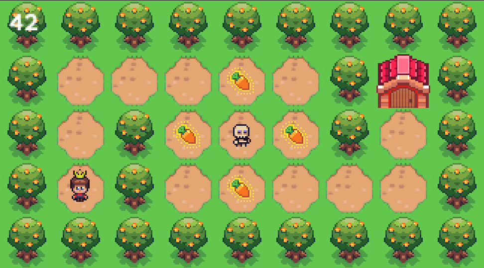

# so_long  
[42 Cursus] A simple 2D game built with **MLX42** where the player must collect all items and reach the exit while navigating a custom map.  
This project was designed to enhance skills in **graphics programming**, **event handling**, and **C programming**.



---

## Features  
- Navigate the map using **W, A, S, D** or **arrow keys**.  
- Collect items and reach the exit while avoiding obstacles.  
- Display the number of movements in the terminal after each action.  
- Simple graphics using **MLX42**.  
- Custom map parsing and validation.  
- Clean window management (ESC key and close button).  

### Bonus Features
- Movement Counter: A counter that displays the number of moves on the game window.
- Item Animation: Items are animated, using the loop hook.
- Player Animation: The player sprite animates when moving, using the key hook.
- Enemies + Animation: Animated Enemies are added to the map, using loop hook. 
- Exit Animation: when all collectibles are collected, the exit opens. 

---

## How to Play

1. Use the **arrow keys** or **WASD** to move the player.
2. Collect all the items (`C`) on the map to unlock the exit (`E`).
3. Reach the exit to win the game!
4. Avoid static enemies (`X`), as they block your path.

### Controls

- **W** / **Up Arrow**: Move up.
- **A** / **Left Arrow**: Move left.
- **S** / **Down Arrow**: Move down.
- **D** / **Right Arrow**: Move right.
- **ESC**: Quit the game.

---

## What I Learned  
This project was a great opportunity to deepen my understanding of:  
- **Graphics Programming**: Working with **MLX42** to render textures, handle window events, and manage animations.  
- **Memory Management**: Ensuring proper allocation and deallocation of resources to avoid leaks.  
- **Map Parsing and Validation**: Implementing robust logic to validate map files and ensure they meet game requirements.  
- **Event Handling**: Managing keyboard inputs and window events for smooth gameplay.  
- **Problem Solving**: Debugging and optimizing code to handle edge cases and improve performance.  

---

## Installation  
Requites **MLX42** library and its dependencies.  

### How to Run  
1. Clone this repository:  
   ```bash  
   git clone https://github.com/yourusername/so_long.git  
   cd so_long  
   ```  

2. Compile the project using the provided **Makefile**, use the bonus rule for a better experience:  
   ```bash  
   make bonus
   ```  

3. Run the game with a map file (e.g., `example.ber` for mandatory, `enemies.ber` for bonus):  
   ```bash  
   ./so_long assets/maps/enemies.ber
   ```  

---

## Assets Credits  
The sprites and textures used in this project are a mix of **custom-made assets** and modified/copied assets from **[Sunnyside World by Daniel Diggle](https://danieldiggle.itch.io/sunnyside)**, available for free on itch.io.  
- **Custom Assets**: Some textures were created or modified by me to fit the game's theme.  
- **Sunnyside World**: The original sprites and textures were sourced from this fantastic resource.  
Thank you to the creator for making these assets available!  

---

## Author

- **Name**: Oliver King Zamora
- **GitHub**: [oliverkingz](https://github.com/oliverkingz)
- **42 Login**: ozamora-

---

## Acknowledgments  
This project is part of the **42 Cursus**, a rigorous programming curriculum that emphasizes hands-on learning and problem-solving. Special thanks to the 42 team for providing this challenging and rewarding project!  

--- 
